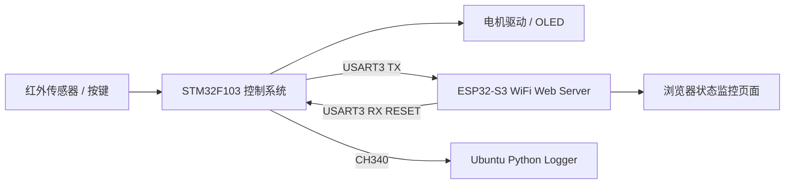

STM32 计数/电机控制系统：Linux 日志采集与 ESP32-S3 无线监控扩展

基于 STM32F103 的红外计数与电机控制系统，扩展 Ubuntu Linux 串口日志采集和 ESP32-S3 WiFi Web 监控，实现**本地控制 → 状态记录 → 无线显示 → 网页 RESET 控制**的完整智能硬件原型链路。

系统情况总览


esp32和linuxi调试画面


系统结构



已完成功能

| 功能 | 说明 |
|------|------|
| STM32 本地计数/电机控制 | 4 状态非阻塞状态机 + EXTI IR 计数 + PWM 电机 + 软启动 |
| PCB V1 设计/打样/调试 | 嘉立创 EDA 模块化载板，已验证核心逻辑链路 |
| USART3 周期性状态输出 | 每 500ms 输出 `STATE=IDLE,TARGET=3,CURRENT=0,TOTAL=25,MOTOR=OFF` |
| Ubuntu Linux 串口日志 | CH340 / minicom / Python pyserial 时间戳日志保存 |
| ESP32-S3 WiFi Web Server | Arduino IDE + ESP32S3 Dev Module + WebServer |
| ESP32 接收 STM32 数据 | UART1 (GPIO18 RX / GPIO17 TX) 接收并解析 `STATE=` 行 |
| Web 页面实时显示 | STATE / TARGET / CURRENT / TOTAL / MOTOR + Raw UART Data |
| 网页 RESET 按钮反向控制 | ESP32 → USART3_RX → STM32 → App_ResetToIdle() |

项目结构

```
STM32_COUNTER_PROJECT/
├── 2-1/                              # Keil MDK 工程 (STM32F103)
│   ├── user/                         # 应用层 (app / app_key / app_time / uart_debug)
│   ├── hardware/                     # 外设驱动 (Motor / PWM / CountSensor / OLED / LED / Key)
│   ├── library/                      # STM32 标准外设库
│   └── start/                        # 启动文件 + CMSIS
├── esp32/stm32_wifi_monitor/         # ESP32-S3 Arduino 工程
│   ├── stm32_wifi_monitor.ino
│   └── README.md
├── linux/serial_logger/              # Linux Python 日志采集
│   ├── serial_logger.py
│   └── README.md
├── docs/                             # 项目文档
│   ├── project_evolution.md          # 迭代演变过程
│   ├── linux_serial_logger.md        # Linux 日志采集文档
│   ├── esp32_wifi_monitor.md         # ESP32 无线监控文档
│   ├── wiring_reference.md           # 接线参考


文档导航

| 文档 | 内容 |
|------|------|
| [docs/project_evolution.md](docs/project_evolution.md) | 完整迭代过程：从 STM32 本地控制到双向无线通信 |
| [docs/linux_serial_logger.md](docs/linux_serial_logger.md) | Ubuntu + CH340 + Python 串口日志采集 |
| [docs/esp32_wifi_monitor.md](docs/esp32_wifi_monitor.md) | ESP32-S3 WiFi Web Server + RESET 控制 |
| [docs/debug_journal.md](docs/debug_journal.md) | 8 个调试问题的排查过程 |
| [docs/wiring_reference.md](docs/wiring_reference.md) | 接线表、供电原则、面包板注意事项 |


开发环境

| 组件 | 工具 |
|------|------|
| STM32 | Keil MDK v5 + STM32F10x Standard Peripheral Library |
| ESP32 | Arduino IDE + ESP32S3 Dev Module + esp32 by Espressif Systems |
| Linux | Ubuntu + Python3 pyserial + minicom |
| PCB | 嘉立创 EDA |

## 快速开始

STM32

1. Keil MDK 打开 `2-1/project.uvprojx`
2. 编译下载到 STM32F103C8T6
3. 串口助手连接 USART3 (115200 8N1)

ESP32

1. Arduino IDE 打开 `esp32/stm32_wifi_monitor/stm32_wifi_monitor.ino`
2. 修改 WiFi 名称和密码
3. 选择 `ESP32S3 Dev Module`，上传
4. 浏览器访问 ESP32 IP 地址

Linux

```bash
cd linux/serial_logger
python3 serial_logger.py
```
